# Rapport d'usage de l'IA - TP1 - EL DADA Acile & DOUGHANE Saadeddine

## Mission 0 — Cartographie

Objectif : comprendre le code existant avant d'y toucher.

On a listé les fichiers de `frontend-starter/src` et demandé à l'IA d'expliquer le rôle de chacun (routes.ts, main.ts, auth.service.ts, auth.interceptor.ts, auth.guard.ts), puis de nous faire un schéma du flux de connexion.

On a vérifié en lisant nous-mêmes chaque fichier proposé, et en testant en vrai dans DevTools (Network) que la requête de login correspondait bien à ce qui était décrit.

Fichiers modifiés : aucun, c'était juste de la lecture.

Preuve : capture Network de la requête login (200 OK) + les deux schémas en pièce jointe.

#### Requête Login exécutée avec succès : 

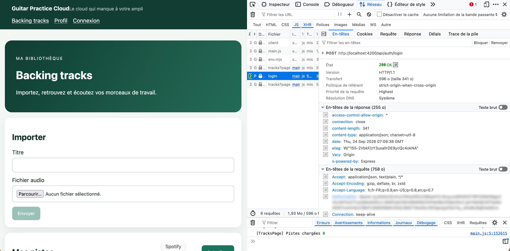

#### Cartographie du frontend :
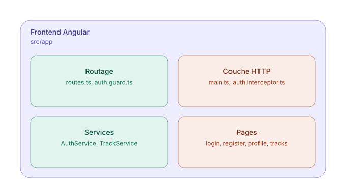

#### Flux de connexion :
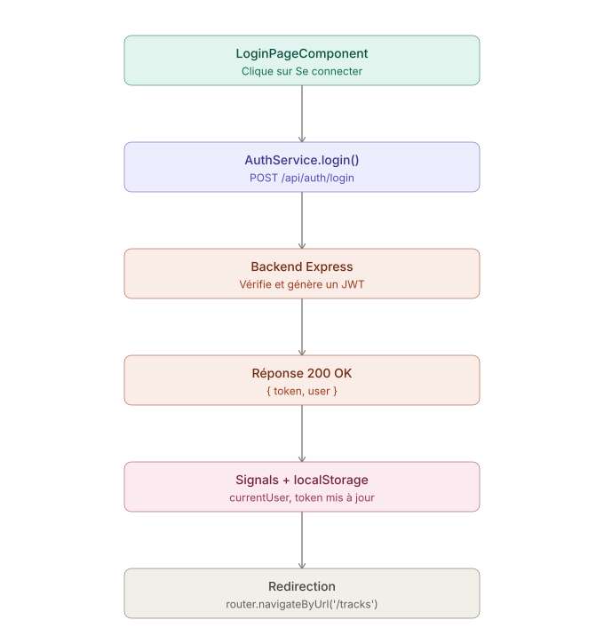

On sait maintenant expliquer : où se trouve quoi dans le projet Angular, et le trajet complet d'une connexion (composant → service → HttpClient → backend → JWT → redirection).

## Mission 1 — Connexion et profil

La majorité du code était déjà là grâce au starter. On a comparé chaque point de la checklist du sujet avec le code existant pour voir ce qui manquait vraiment.

Deux choses manquaient. D'abord la gestion du 401 : si le token expire ou devient invalide, rien ne redirigeait vers /login. On a codé ça dans l'intercepteur, avec un catchError qui détecte le statut 401 et déclenche la déconnexion + la redirection.

Ensuite, en testant l'appli à la main, on s'est rendu compte qu'il n'y avait pas de bouton de déconnexion dans le header, alors que la fonction logout() existait déjà dans le service. On l'a ajouté dans app.ts et app.html.

On a ensuite testé un par un tous les points du sujet et pris les différentes captures d'écran aux étapes de test.

Formulaires et validations : testé avec un formulaire vide sur /register, le message "Nom, email et mot de passe de 8 caractères requis" s'affiche correctement.

#### Test de création avec formulaire vide 
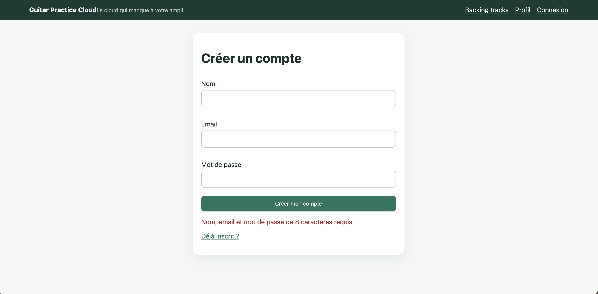

Connexion refusée : testé avec un mauvais mot de passe, message "Identifiants incorrects" affiché et requête en 401 dans Network.

#### Connexion avec un mauvais mot de passe
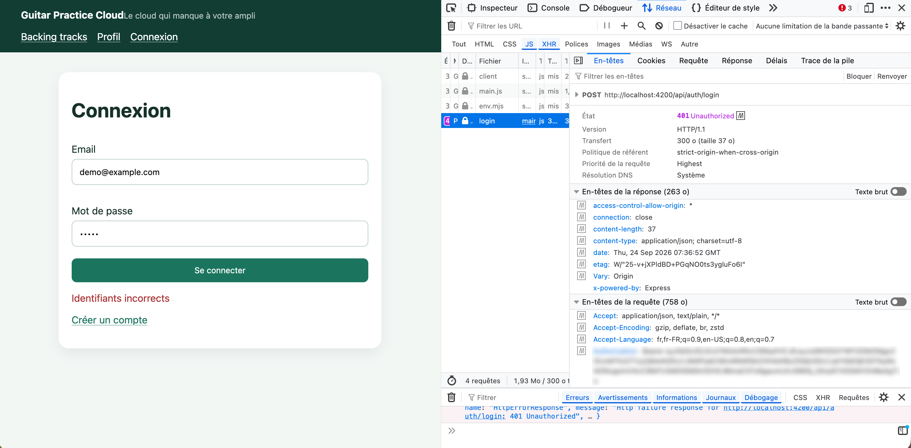

Token jamais loggé : vérifié la console après connexion, rien qui affiche le token en clair.

#### Vérification qu'aucun token n'apparaît dans la console
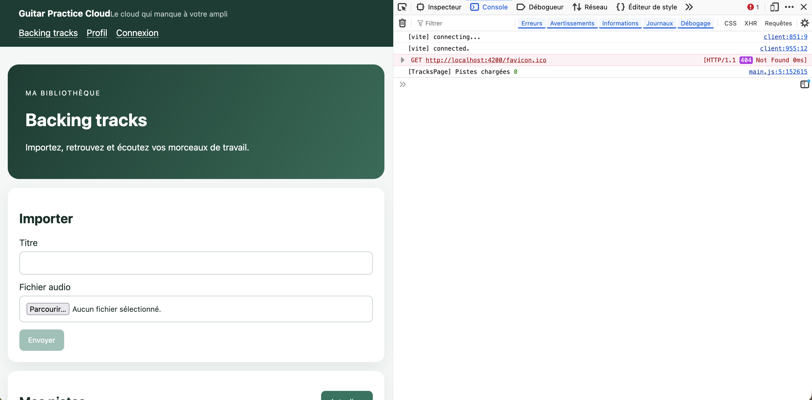

Chargement du profil : la requête GET /api/users/me renvoie les données et elles s'affichent correctement sur la page.

#### Chargement du profil utilisateur
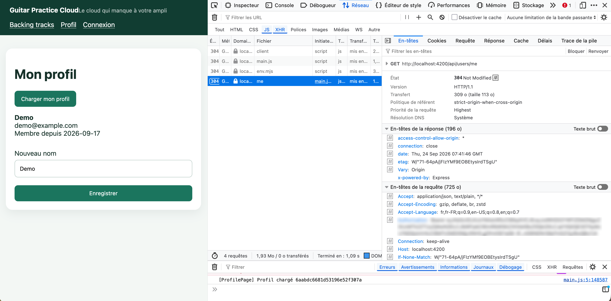

Modification du nom : la requête PUT /api/users/me passe bien et le nouveau nom s'affiche immédiatement.

#### Modification et enregistrement du nom
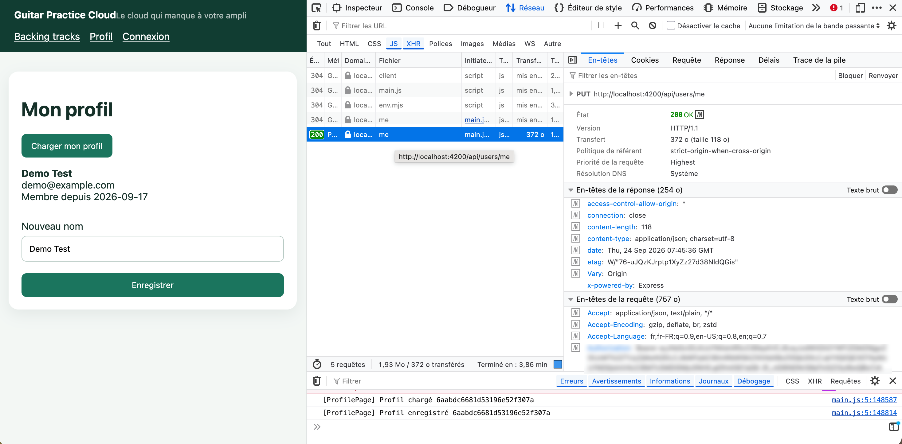

Déconnexion : en testant, on a découvert que le bouton n'existait pas du tout dans le header. Une fois ajouté, on a aussi remarqué qu'après un F5 on avait l'air déconnecté alors que le token était toujours valide. Corrigé en basant l'affichage sur le token plutôt que sur l'objet utilisateur complet.

#### Ajout du bouton de déconnexion (manquant à l'origine)
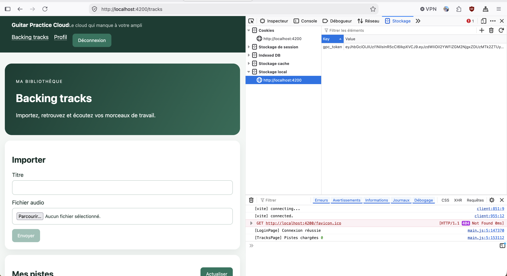

Une fois le bouton testé, la redirection vers /login fonctionne et le token disparaît bien du localStorage.

#### Déconnexion effective (redirection + token supprimé)
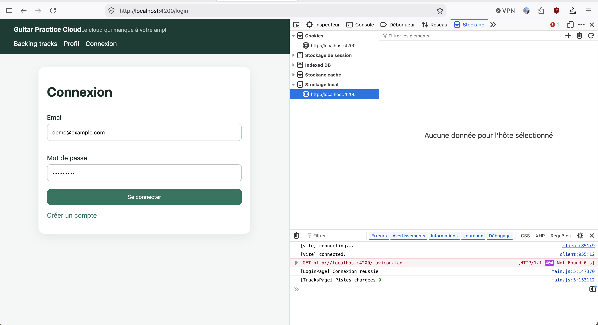

Gestion du 401 : en cassant volontairement le token dans le localStorage puis en rechargeant la page, la requête vers /api/users/me échoue en 401 et l'application redirige automatiquement vers /login.

#### Token invalide : détection du 401 et redirection automatique
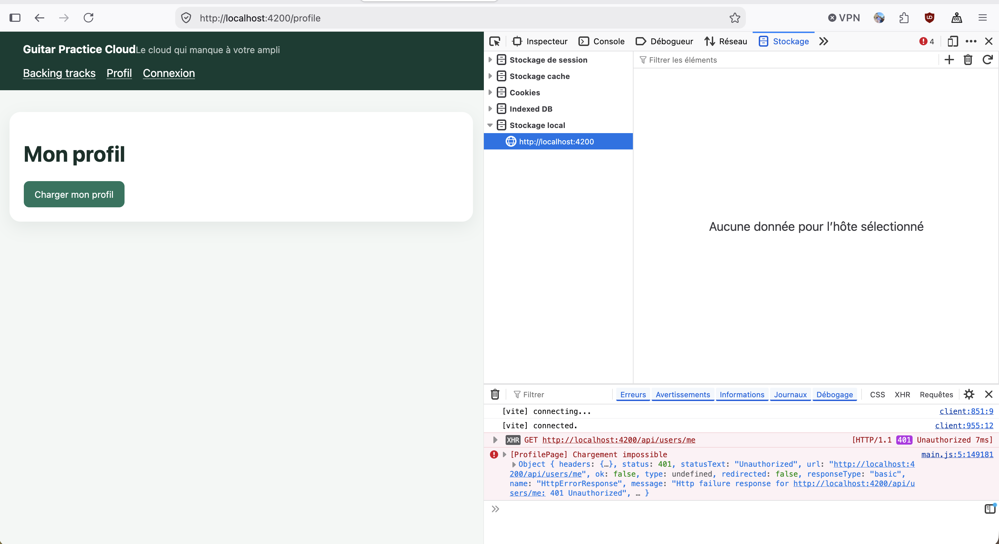

 Détail intéressant appris à cette dernière étape : modifier le token directement dans le localStorage ne suffit pas, rien ne se passe tant qu'on ne recharge pas la page. 
 Le Signal qui garde le token en mémoire ne se relit pas tout seul quand localStorage change pendant que l'app tourne.

Ça amène justement à la différence entre les deux : un Signal est réactif, dès qu'il change l'interface se met à jour toute seule, mais il est perdu à chaque rechargement de page. 

Le localStorage lui persiste sur le disque et survit au refresh, mais rien ne prévient l'application quand sa valeur change. Le token utilise les deux en même temps, pour combiner les deux avantages.

On a utilisé un assistant IA notamment pour mettre en forme ce rapport et pour la rédaction initiale du catchError dans l'intercepteur, qu'on a ensuite adapté et testé nous-mêmes.
