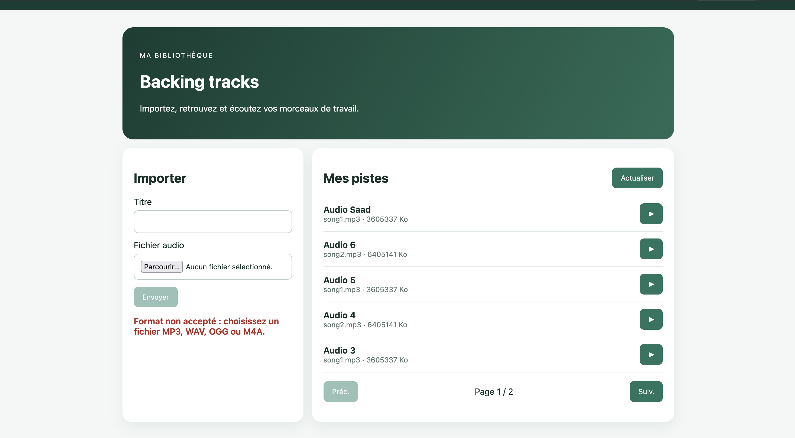
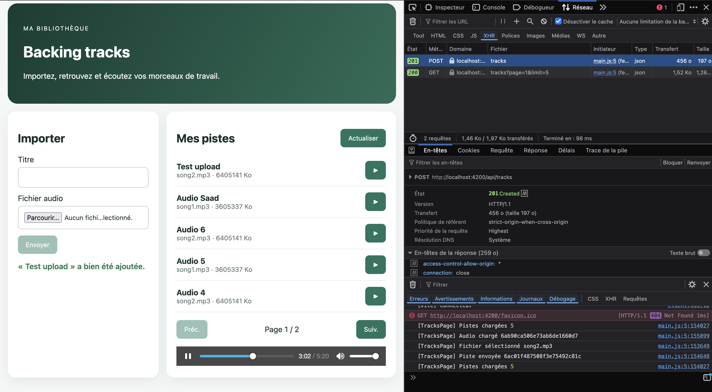
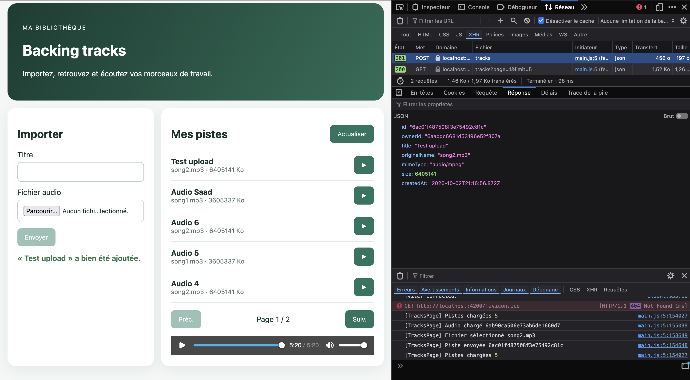
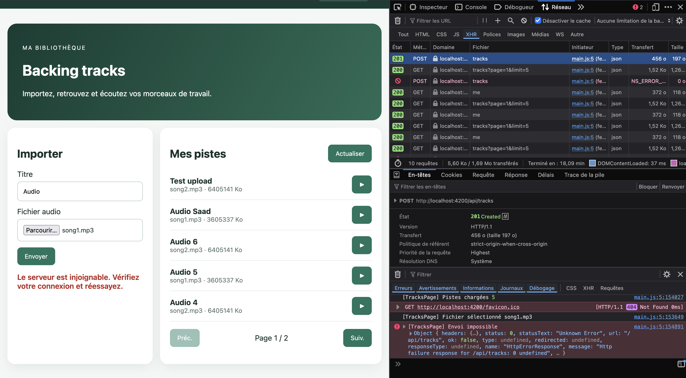
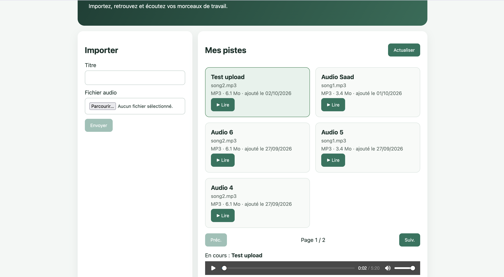
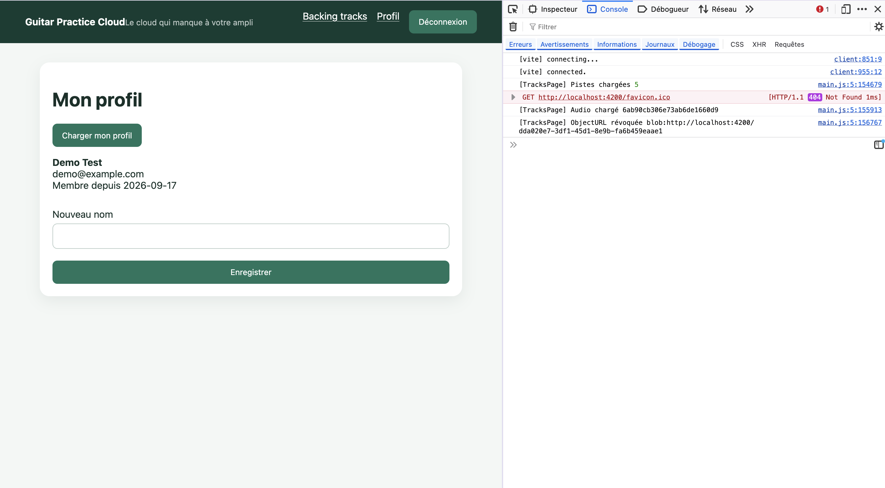

# Rapport d'usage de l'IA - DOUGHANE Saadeddine & EL DADA Acile 
Assistant utilisé : Claude (Anthropic), modèle Claude Opus 5.5

## Sommaire
- [TP1 — Authentification et profil](#tp1)
- [TP2 — Bibliothèque, upload et lecture audio](#tp2)

# TP1
## Mission 0 — Cartographie

Objectif : comprendre le code existant avant d'y toucher.

On a listé les fichiers de `frontend-starter/src` et demandé à l'IA d'expliquer le rôle de chacun (routes.ts, main.ts, auth.service.ts, auth.interceptor.ts, auth.guard.ts), puis de nous faire un schéma du flux de connexion.

On a vérifié en lisant nous-mêmes chaque fichier proposé, et en testant en vrai dans DevTools (Network) que la requête de login correspondait bien à ce qui était décrit.

Fichiers modifiés : aucun, c'était juste de la lecture.

Preuve : capture Network de la requête login (200 OK) + les deux schémas en pièce jointe.

#### Requête Login exécutée avec succès : 

#### Cartographie du frontend :

#### Flux de connexion :

On sait maintenant expliquer : où se trouve quoi dans le projet Angular, et le trajet complet d'une connexion (composant → service → HttpClient → backend → JWT → redirection).

## Mission 1 — Connexion et profil

La majorité du code était déjà là grâce au starter. On a comparé chaque point de la checklist du sujet avec le code existant pour voir ce qui manquait vraiment.

Deux choses manquaient. D'abord la gestion du 401 : si le token expire ou devient invalide, rien ne redirigeait vers /login. On a codé ça dans l'intercepteur, avec un catchError qui détecte le statut 401 et déclenche la déconnexion + la redirection.

Ensuite, en testant l'appli à la main, on s'est rendu compte qu'il n'y avait pas de bouton de déconnexion dans le header, alors que la fonction logout() existait déjà dans le service. On l'a ajouté dans app.ts et app.html.

On a ensuite testé un par un tous les points du sujet et pris les différentes captures d'écran aux étapes de test.

Formulaires et validations : testé avec un formulaire vide sur /register, le message "Nom, email et mot de passe de 8 caractères requis" s'affiche correctement.

#### Test de création avec formulaire vide 

Connexion refusée : testé avec un mauvais mot de passe, message "Identifiants incorrects" affiché et requête en 401 dans Network.

#### Connexion avec un mauvais mot de passe

Token jamais loggé : vérifié la console après connexion, rien qui affiche le token en clair.

#### Vérification qu'aucun token n'apparaît dans la console

Chargement du profil : la requête GET /api/users/me renvoie les données et elles s'affichent correctement sur la page.

#### Chargement du profil utilisateur

Modification du nom : la requête PUT /api/users/me passe bien et le nouveau nom s'affiche immédiatement.

#### Modification et enregistrement du nom

Déconnexion : en testant, on a découvert que le bouton n'existait pas du tout dans le header. Une fois ajouté, on a aussi remarqué qu'après un F5 on avait l'air déconnecté alors que le token était toujours valide. Corrigé en basant l'affichage sur le token plutôt que sur l'objet utilisateur complet.

#### Ajout du bouton de déconnexion (manquant à l'origine)

Une fois le bouton testé, la redirection vers /login fonctionne et le token disparaît bien du localStorage.

#### Déconnexion effective (redirection + token supprimé)

Gestion du 401 : en cassant volontairement le token dans le localStorage puis en rechargeant la page, la requête vers /api/users/me échoue en 401 et l'application redirige automatiquement vers /login.

#### Token invalide : détection du 401 et redirection automatique

 Détail intéressant appris à cette dernière étape : modifier le token directement dans le localStorage ne suffit pas, rien ne se passe tant qu'on ne recharge pas la page. 
 Le Signal qui garde le token en mémoire ne se relit pas tout seul quand localStorage change pendant que l'app tourne.

Ça amène justement à la différence entre les deux : un Signal est réactif, dès qu'il change l'interface se met à jour toute seule, mais il est perdu à chaque rechargement de page. 

Le localStorage lui persiste sur le disque et survit au refresh, mais rien ne prévient l'application quand sa valeur change. Le token utilise les deux en même temps, pour combiner les deux avantages.

On a utilisé un assistant IA notamment pour mettre en forme ce rapport et pour la rédaction initiale du catchError dans l'intercepteur, qu'on a ensuite adapté et testé nous-mêmes.

# TP2

## Mission 2 — Bibliothèque paginée

On a d'abord vérifié ce que le starter faisait déjà : le service envoyait bien `page` et `limit` au serveur, et les Signals et le template (`@for`, `@empty`, `@if`) étaient en place.

Pour tester, on a uploadé 6 pistes, puis vérifié dans Network que chaque clic sur « Suiv. » envoyait une nouvelle requête avec `page=2`. La réponse ne contenait qu'une piste : la pagination est bien faite côté serveur.

Il manquait le Signal d'erreur demandé par le sujet. On l'a ajouté, et on a corrigé deux petits défauts : « Aucune piste » s'affichait pendant le chargement, et on pouvait cliquer plusieurs fois sur les boutons pendant une requête. En modifiant le template, une accolade mal placée cachait les boutons de pagination, qu'on a dû corriger.

On a testé l'erreur en arrêtant le backend : le message rouge apparaît bien.

#### Pagination côté serveur (page 2)

## Mission 3 — Analyse du code existant

Avant de coder, on a lu le code fourni : `track.service.ts`, `tracks-page.ts`, `auth.interceptor.ts`, `main.ts` et `backend/src/app.js`, pour repérer chaque étape de l'upload et de la lecture, et comprendre le rôle de Multer côté backend.

On a vérifié dans Network que la requête de lecture envoie bien le JWT dans le header `Authorization` et que le serveur répond en `audio/mpeg`. On a masqué le token sur la capture.

En relisant l'intercepteur, on s'est rendu compte que le `catchError` décrit dans le rapport du TP1 n'avait jamais été commité : seule la vérification au démarrage dans `app.ts` était présente. On l'a remis dans l'intercepteur et refait le test du token invalide (401, déconnexion, retour vers `/login`).

#### Lecture audio authentifiée

## Mission 3 — Améliorations de l'upload

On a ajouté une vérification du fichier avant l'envoi (mêmes formats et même taille max que le backend), un état « Envoi en cours… » qui bloque les doubles envois, des messages d'erreur et de succès, et la remise à zéro complète du formulaire après succès.

On a testé chaque cas : fichier au mauvais format (glissé-déposé pour contourner le filtre du sélecteur), faux MP3 de 30 Mo, envoi réussi, et backend arrêté. Ce dernier test affichait un message technique en anglais (« NetworkError… ») : on l'a remplacé par un message clair quand le serveur ne répond pas.

#### Fichier au mauvais format

#### Envoi réussi : requête multipart avec le champ audio

#### Réponse du serveur avec le titre

#### Serveur injoignable

## Mission 3 — Cards et lecture

On a transformé la liste des pistes en cards, avec la taille en Mo (elle était affichée en « Ko » alors que c'était en octets), le format lisible (MP3 au lieu de audio/mpeg) et la date d'ajout. La grille est responsive, et on l'a testée en vue mobile dans Firefox.

On a ajouté l'affichage du morceau en cours, un message pendant le téléchargement du fichier, des messages d'erreur de lecture clairs, et la libération de la dernière ObjectURL quand on quitte la page (`ngOnDestroy`). Pour le prouver, on a ajouté un log dans la console.

#### Cards et morceau en cours

#### Révocation de l'ObjectURL en quittant la page

## Utilisation de l'IA sur ce TP

On s'est servi de l'assistant pour comprendre le code fourni et nous proposer les modifications, qu'on a ensuite relues, adaptées et testées nous-mêmes dans le navigateur.

La tâche où il nous a le plus aidés est l'amélioration de l'upload. Deux points nous bloquaient : après un envoi réussi, le nom du fichier restait affiché alors qu'on vidait notre variable, et quand le backend était arrêté, le message affiché était un « NetworkError » technique en anglais. L'assistant nous a expliqué qu'il fallait vider l'élément `<input>` lui-même (en le passant à `upload()` avec `#fileInput`), et distinguer le cas `status === 0`, où le serveur ne répond pas du tout, pour afficher notre propre message. On a vérifié les deux corrections avec nos tests d'upload.