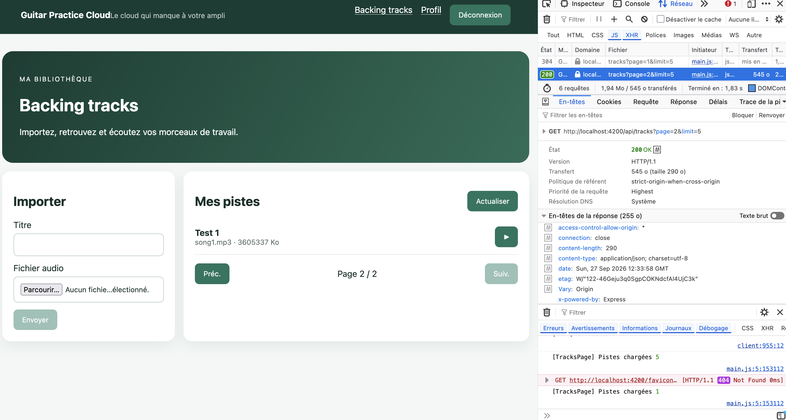
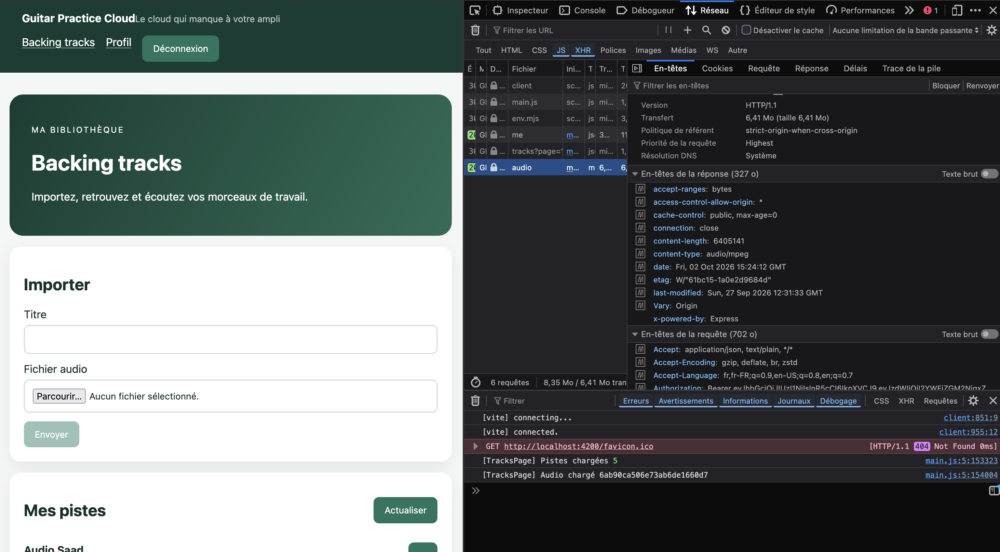
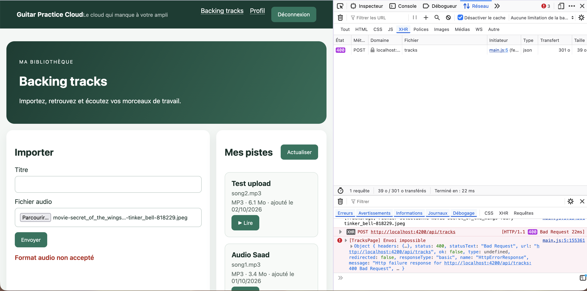
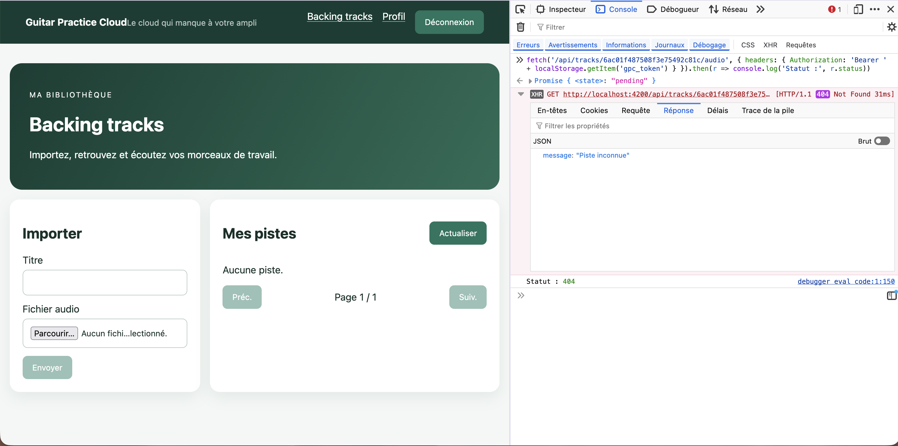

# TP2 — Bibliothèque, upload et lecture audio 

DOUGHANE Saadeddine & EL DADA Acile 


## Captures d'écrans

#### Pagination :


#### Lecture audio avec authentification  : 


Pour écouter une piste, il faut être connecté et que la piste nous appartienne. Sur la capture, on voit que la requête `GET /api/tracks/:id/audio` envoie notre JWT dans le header `Authorization`, et que le serveur répond 200 avec un fichier `audio/mpeg`.

Côté backend, la piste est cherchée avec notre id comme propriétaire :
```js
Track.findOne({ _id: req.params.id, ownerId: req.auth.sub })
```
Sans token, le serveur répond 401. Et si la piste appartient à quelqu'un d'autre, il répond 404.

## 1. Où se trouve quoi dans le code

Tout se passe dans `tracks-page.ts`, `tracks-page.html` et `track.service.ts` :
- choix du fichier : `choose()` dans le composant 
- FormData et appel d'upload : `upload()` dans le service
- récupération du Blob : `audio()` dans le service (`responseType: 'blob'`)
- préparation de la lecture (création de l'ObjectURL, envoi au lecteur, libération de l'ancienne) : `play()` dans le composant.

Le FormData contient bien `audio` et `title`.

```ts
// track.service.ts
const body = new FormData();
body.append('audio', file);
body.append('title', title);
```

## 2. Flux d'upload et de lecture

**Upload :** le composant appelle le service, qui met le fichier et le titre dans un FormData et l'envoie avec `HttpClient` en `POST /api/tracks`.

**Lecture :** au clic sur le bouton play, le service télécharge tout le fichier sous forme de Blob. Ensuite, `URL.createObjectURL()` crée une adresse locale que l'on donne au lecteur `<audio>`.

```ts
// tracks-page.ts, méthode play()
const previousUrl = this.audioUrl();
if (previousUrl) URL.revokeObjectURL(previousUrl);
this.audioUrl.set(URL.createObjectURL(blob));
```

## 3. Intercepteur JWT

L'intercepteur (`auth.interceptor.ts`, activé dans `main.ts`) ajoute `Authorization: Bearer <token>` à chaque requête de `HttpClient`.

```ts
// auth.interceptor.ts
request.clone({
  setHeaders: { Authorization: `Bearer ${token}` },
})
```

Si l'on mettait directement l'URL de l'API dans `<audio src>`, c'est le navigateur qui ferait la requête, pas Angular. L'intercepteur ne passerait pas, le token ne serait pas envoyé, et le serveur répondrait 401.

## 4. Contrôles côté backend

Dans `backend/src/app.js`, Multer vérifie que le fichier est bien dans le champ `audio`, que c'est un format audio autorisé (mp3, wav, ogg, m4a) et qu'il fait moins de 25 Mo. Sinon, le serveur renvoie une erreur 400. Le titre est lu dans `req.body.title`.

```js
// backend/src/app.js
const MAX_FILE_SIZE = 25 * 1024 * 1024;
app.post("/api/tracks", auth, upload.single("audio"), ...)
```

Les fichiers sont stockés sur le disque (`data/uploads/`), et MongoDB ne garde que leurs infos.

## 5. Validation frontend vs backend

Avant l'envoi, nous vérifions le fichier côté Angular avec les mêmes règles que le backend : format audio autorisé (mp3, wav, ogg, m4a) et 25 Mo maximum. Si le fichier est invalide, un message s'affiche tout de suite et aucune requête n'est envoyée.

```ts
// tracks-page.ts
if (!ALLOWED_TYPES.includes(file.type)) return 'Format non accepté…';
if (file.size > MAX_FILE_SIZE) return 'Fichier trop volumineux…';
```

Cette validation améliore l'expérience : l'utilisateur sait immédiatement ce qui ne va pas, sans attendre l'envoi d'un fichier lourd inutilement.

Mais elle ne remplace pas celle du backend, car tout ce qui se passe dans le navigateur peut être contourné. Nous l'avons vu nous-mêmes en essyant : un simple glisser-déposer contourne le filtre `accept` du champ fichier. Et n'importe qui peut envoyer une requête directement à l'API, sans passer par notre site. Seul le serveur est sûr.

## 6. Blob, buffering et streaming

Ce sont trois choses différentes :

- **Téléchargement complet d'un Blob** : c'est ce que fait notre application. `HttpClient` attend d'avoir reçu tout le fichier avant de nous le donner. C'est pour ça que nous affichons « Chargement du morceau… » : la lecture ne peut pas commencer avant la fin du téléchargement.

- **Buffering du navigateur** : quand un lecteur `<audio>` lit une URL HTTP classique, il télécharge un peu d'avance et commence à jouer sans attendre la fin. Il continue de charger pendant la lecture.

- **Streaming côté serveur** : c'est la façon dont le serveur envoie le fichier. Notre backend utilise `res.sendFile`, qui lit le fichier par morceaux depuis le disque au lieu de le charger entièrement en mémoire. Sur notre capture (en haut de ce document), l'en-tête `accept-ranges: bytes` montre aussi qu'il accepte d'envoyer seulement une partie du fichier.

Dans notre cas, le serveur sait donc envoyer le fichier progressivement, mais côté Angular, nous attendons quand même le fichier complet, à cause du Blob.

## Checkpoint Network

- **Pagination** : chaque clic sur « Suivant » change le paramètre `page` (capture en haut du document).

- **Upload multipart** : la requête `POST /api/tracks` est en `multipart/form-data` et contient les champs `audio` et `title`.

- **Lecture** : la réponse de `/api/tracks/:id/audio` est un flux `audio/mpeg` (capture en haut du document).

- **Erreur 400** : en désactivant temporairement notre validation front, le serveur refuse un fichier qui n'est pas un audio (ici test avec une img) et nous affichons son message.



- **Propriétaire** : avec un second compte, la bibliothèque est vide, et demander l'audio d'une piste du premier compte renvoie 404 « Piste inconnue ».



## 7. Le choix Blob + ObjectURL

La lecture d'une piste est protégée : le serveur exige notre JWT. Or, si nous mettions directement l'URL de l'API dans `<audio src>`, c'est le navigateur qui ferait la requête, sans passer par notre intercepteur, donc sans le token.

C'est pour cela que nous téléchargeons d'abord le fichier avec `HttpClient` (qui ajoute le JWT), sous forme de Blob. Ensuite, `URL.createObjectURL()` crée une adresse locale (`blob:http://localhost:4200/...`) que le lecteur `<audio>` peut lire directement depuis la mémoire.

- **Avantage** : la lecture reste sécurisée, seul le propriétaire peut écouter sa piste.

- **Inconvénients** : il faut attendre la fin du téléchargement avant d'écouter, et le fichier occupe de la mémoire tant que l'URL n'est pas révoquée.

## 8. Réponse aux questions : mémoire, buffering et streaming

**1. Le backend envoie-t-il le fichier entier en mémoire, ou peut-il l'envoyer progressivement depuis le disque ?**

Progressivement. Le backend utilise `res.sendFile`, qui lit le fichier par morceaux depuis le disque au lieu de le charger entièrement en mémoire.

**2. Avec `HttpClient` et `responseType: "blob"`, à quel moment le composant reçoit-il le fichier ?**

Seulement à la fin. `HttpClient` attend d'avoir reçu tout le fichier avant de nous donner le Blob. C'est pour cela que nous affichons « Chargement du morceau… ».

**3. Avec 100 morceaux, les 100 fichiers sont-ils chargés en mémoire dès l'affichage de la liste ?**

Non. La liste ne charge que les informations des pistes (titre, taille, date…), et seulement 5 par page grâce à la pagination. Un fichier audio n'est téléchargé que quand on clique sur « Lire », dans `play()` :
```ts
play(track: Track): void {
  this.service.audio(track.id).subscribe(...)
}
```
Et comme l'ancienne URL est révoquée à chaque nouvelle lecture, un seul fichier reste en mémoire à la fois.

**4. Quelle différence avec 100 éléments `<audio>` utilisant directement une URL HTTP ?**

Le navigateur pourrait commencer à précharger les 100 fichiers, ce qui ferait beaucoup de requêtes. En revanche, il ferait du vrai streaming : la lecture commencerait avant la fin du téléchargement, et on pourrait avancer dans le morceau. Mais dans notre cas, ces requêtes partiraient sans le JWT, et le serveur répondrait 401.

**5. Pourquoi l'URL créée par `URL.createObjectURL` doit-elle être révoquée ?**

Tant que l'URL existe, le navigateur garde le fichier en mémoire. Sans `revokeObjectURL`, chaque lecture ajouterait plusieurs Mo jamais libérés. Nous révoquons donc l'ancienne URL à chaque nouvelle lecture, et la dernière dans `ngOnDestroy()`, quand on quitte la page. Nous l'avons vérifié avec un log dans la console.