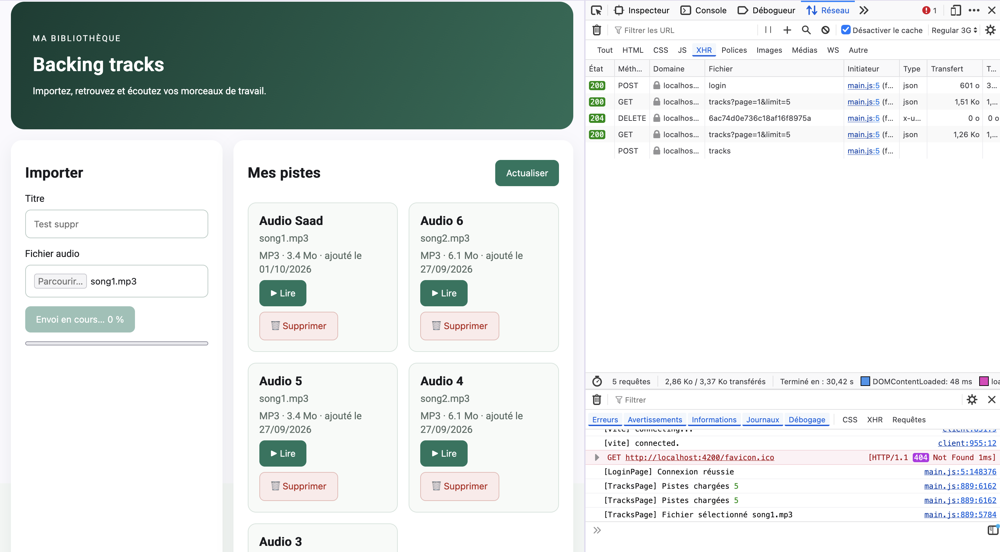
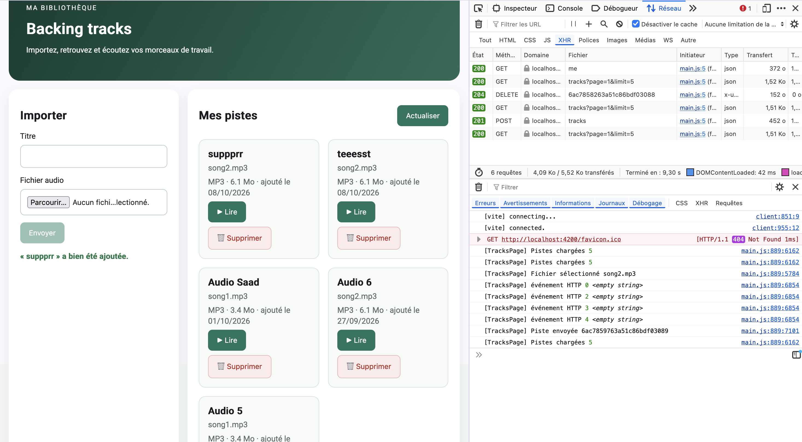
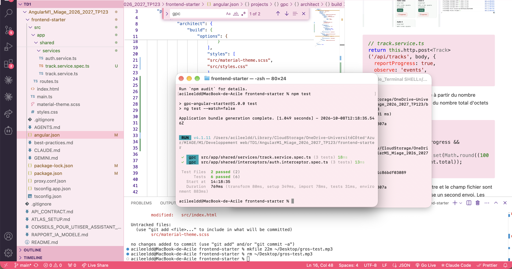

# TP3 — Fiabilisation et enrichissement du frontend

DOUGHANE Saadeddine & EL DADA Acile

## Mission 5 — Suppression d'une piste

Capture de la suppression (requête `DELETE` en 204 et SnackBar) :


### Composant et service concernés

La suppression est gérée par `TracksPageComponent` (méthode `deleteTrack()`) et `TrackService` (méthode `delete()`). Le composant ne connaît pas l'URL : il appelle le service, qui fait le `DELETE /api/tracks/:id` avec `HttpClient`.

```ts
// track.service.ts
delete(id: string) {
  return this.http.delete<void>(`/api/tracks/${id}`);
}
```

Avant l'appel, le composant demande confirmation. Le signal `deletingId` bloque les doubles clics. Après un succès, la liste est rechargée depuis le serveur, et nous reculons d'une page si nous venons de supprimer la dernière piste de la dernière page. Si le serveur répond 404 (piste déjà supprimée dans un autre onglet, ou appartenant à un autre utilisateur), un SnackBar l'explique et la liste est rechargée pour faire disparaître la piste.

### Pourquoi le guard et l'interface ne suffisent pas

Le guard Angular et le bouton « Supprimer » s'exécutent dans le navigateur, et l'utilisateur peut les contourner. Quelqu'un peut envoyer un `DELETE` directement avec `curl` ou depuis la console, sans passer par notre interface.

C'est donc le backend qui sécurise réellement : son middleware `auth` vérifie la signature du JWT, et la route cherche la piste avec `{ _id, ownerId: req.auth.sub }`. Si la piste n'appartient pas à l'utilisateur, elle n'est pas trouvée et le serveur répond 404.

## Mission 6 — Progression de l'upload



Un upload avec progression ne se traite pas comme une requête normale. Une requête normale n'émet qu'une seule valeur : la réponse finale. Avec `reportProgress: true` et `observe: 'events'`, Angular émet plusieurs événements : `Sent`, puis plusieurs `UploadProgress` (avec `loaded` et `total`), puis `Response`. Nous devons donc trier les événements selon leur type.

En local, l'envoi d'un fichier de quelques Mo est presque instantané donc le pourcentage passe de 0 % à 100 % très vite, et le navigateur et le proxy de développement regroupent l'envoi. Nous avons donc vérifié le mécanisme avec la console, qui affiche les événements `Sent`, `UploadProgress` (avec `loaded` et `total`) puis `Response`.



```ts
// track.service.ts
return this.http.post<Track>('/api/tracks', body, {
  reportProgress: true,
  observe: 'events',
});
```

Angular calcule le pourcentage à partir du nombre d'octets envoyés (`loaded`) et du nombre total d'octets (`total`) :

```ts
// tracks-page.ts
if (event.type === HttpEventType.UploadProgress && event.total) {
  this.uploadProgress.set(Math.round((100 * event.loaded) / event.total));
}
```

Pendant l'envoi, le bouton, le titre et le champ fichier sont désactivés, et la méthode refuse un second envoi. Les quatre états sont : aucun upload, en cours (avec pourcentage et barre), réussite (message vert) et échec (message rouge).

## Mission 7 — Tests automatisés

Nous avons écrit 6 tests avec Vitest et `HttpTestingController`, qui simule le serveur : aucun backend ni MongoDB n'est nécessaire. Résultat : **6 tests passés sur 6**.



**Test 1 — `list()` transmet `page` et `limit`** (`track.service.spec.ts`)
- Attendu : `GET /api/tracks` avec `page=2` et `limit=5`.
- Observé : OK.

**Test 2 — `delete()` appelle la bonne route** (`track.service.spec.ts`)
- Attendu : `DELETE /api/tracks/abc123`.
- Observé : OK.

**Test 3 — `uploadWithProgress()` envoie un multipart** (`track.service.spec.ts`)
- Attendu : `POST /api/tracks` avec les champs `audio` et `title`, et `reportProgress` activé.
- Observé : OK.

**Test 4 — l'intercepteur ajoute le token** (`auth.interceptor.spec.ts`)
- Attendu : header `Authorization: Bearer faux-token` quand un token existe.
- Observé : OK.

**Test 5 — l'intercepteur sans token** (`auth.interceptor.spec.ts`)
- Attendu : aucun header `Authorization`.
- Observé : OK.

**Test 6 — l'intercepteur sur une erreur 401** (`auth.interceptor.spec.ts`)
- Attendu : `logout()` appelé et redirection vers `/login`.
- Observé : OK.
