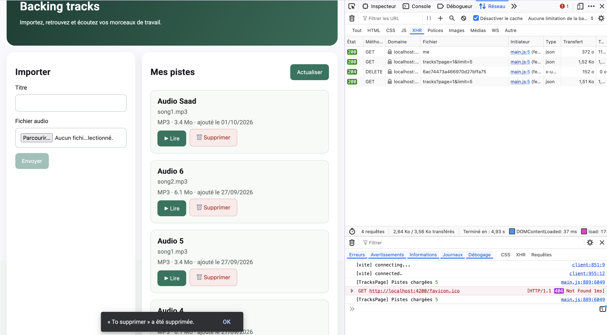

# TP3 — Fiabilisation et enrichissement du frontend

DOUGHANE Saadeddine & EL DADA Acile

## Mission 5 — Suppression d'une piste

Capture de la suppression (requête `DELETE` en 204 et SnackBar) :



### Composant et service concernés

La suppression est gérée par `TracksPageComponent` (méthode `deleteTrack()`) et `TrackService` (méthode `delete()`). Le composant ne connaît pas l'URL : il appelle le service, qui fait le `DELETE /api/tracks/:id` avec `HttpClient`.

```ts
// track.service.ts
delete(id: string) {
  return this.http.delete<void>(`/api/tracks/${id}`);
}
```

Avant l'appel, le composant demande confirmation. Le signal `deletingId` bloque les doubles clics. Après un succès, la liste est rechargée depuis le serveur, et nous reculons d'une page si nous venons de supprimer la dernière piste de la dernière page. Si le serveur répond 404 (piste déjà supprimée dans un autre onglet, ou appartenant à un autre utilisateur), un SnackBar l'explique et la liste est rechargée pour faire disparaître la piste.

### Pourquoi le guard et l'interface ne suffisent pas

Le guard Angular et le bouton « Supprimer » s'exécutent dans le navigateur, et l'utilisateur peut les contourner. Quelqu'un peut envoyer un `DELETE` directement avec `curl` ou depuis la console, sans passer par notre interface.

C'est donc le backend qui sécurise réellement : son middleware `auth` vérifie la signature du JWT, et la route cherche la piste avec `{ _id, ownerId: req.auth.sub }`. Si la piste n'appartient pas à l'utilisateur, elle n'est pas trouvée et le serveur répond 404.